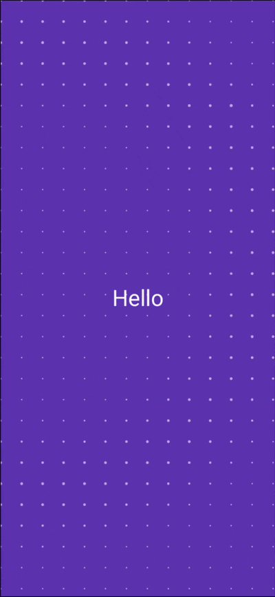

# Compose Widgets Library

[](https://search.maven.org/artifact/io.github.jyotimoykashyap/composecomponents)
[](LICENSE)


A collection of interactive and fun widgets for Jetpack Compose.

This repository contains a growing collection of custom widgets that can be easily integrated into your Android projects to create engaging user experiences.

## Adding Dependency

To use the composables, you need to add the dependency to your project.

There are two ways to add the dependency:

**1. Using `libs.versions.toml` (Recommended)**

In your `gradle/libs.versions.toml` file, add the following library definition:

```toml
[versions]
compose-components = "0.0.2"

[libraries]
compose-components = { group = "io.github.jyotimoykashyap", name = "composecomponents", version.ref = "compose-components" }
```

Then, in your module-level `build.gradle.kts` file (e.g., `app/build.gradle.kts`), add the dependency:

```kotlin
dependencies {
    implementation(libs.compose.components)
}
```

**2. Using `build.gradle.kts` directly**

In your module-level `build.gradle.kts` file (e.g., `app/build.gradle.kts`), add the following dependency:

```kotlin
dependencies {
    implementation("io.github.jyotimoykashyap:composecomponents:0.0.2")
}
```

Once the dependency is added, you can use the provided composables in your UI like this as shown below.


## Widgets

### Progress Button

A button that displays a progress animation from left to right, filling the button's shape.


#### Usage

```kotlin
import com.jyotimoykashyap.composecomponents.ProgressButton

ProgressButton(
    text = "Let's Get Started",
    onClick = {
        // Handle button click
    },
    onProgressComplete = {
        // Handle progress completion
    }
)
```

You can customize the button's shape and progress duration:

```kotlin
ProgressButton(
    text = "Custom Button",
    shape = RoundedCornerShape(12.dp),
    progressDurationMillis = 3000,
    onClick = { /* ... */ },
    onProgressComplete = { /* ... */ }
)
```

### Rippling Dot Grid Modifier

A `Modifier` that applies a dot grid with a propagating ripple animation. This modifier draws a grid of dots over the composable it's applied to. Ripples originate from either the center or random points, expanding outwards and causing the dots they pass over to briefly increase in size. The animation uses a frame-based clock for smooth and reliable updates.



#### Usage

To use the `Modifier.ripplingDotGrid` modifier, ensure you have added the library dependency as described in the "Usage" section for `ProgressButton`.

Once the dependency is added, you can apply the `ripplingDotGrid` modifier to any `Modifier` in your UI:

```kotlin
import com.jyotimoykashyap.composecomponents.ripplingDotGrid
import androidx.compose.foundation.layout.fillMaxSize
import androidx.compose.material3.Surface
import androidx.compose.ui.Modifier
import androidx.compose.ui.graphics.Color
import androidx.compose.ui.unit.dp

Surface(
    modifier = Modifier
        .fillMaxSize()
        .ripplingDotGrid(
            dotColor = Color.White.copy(alpha = 0.6f), // Make dots a bit more visible
            dotSpacing = 30.dp, // Adjust spacing as needed
            dotRadius = 1.dp,
            animationDurationMillis = 4000, // Each ripple lasts 4 seconds
            rippleSpawnIntervalMillis = 1500, // New ripple every 1.5 seconds
            randomRippleCenter = true // Ripples start from random spots
        ),
    color = Color.Red
) {
    // Your content here
}
```

#### Parameters

*   `dotColor`: The color of the dots in the grid.
*   `dotSpacing`: The distance between the centers of adjacent dots.
*   `dotRadius`: The base radius of each dot when not rippling.
*   `animationDurationMillis`: The total duration for a single ripple to expand and fade out.
*   `rippleSpawnIntervalMillis`: The time interval between the spawning of new ripples.
*   `randomRippleCenter`: If true, ripples will originate from random points on the screen. If false, ripples will originate from the center of the composable.

#### Side Effects

*   **Performance**: For extremely large composables or very small `dotSpacing` and `dotRadius`, drawing many dots can have a performance impact, especially on older devices. The animation loop runs every frame, potentially causing continuous recompositions if not handled carefully.
*   **Memory**: Stores a mutable list of active ripple start times. While a cleanup mechanism is in place, a very high `rippleSpawnIntervalMillis` combined with a long `animationDurationMillis` could lead to many ripples being tracked concurrently, though this is unlikely to be a significant issue in most use cases.

## Contribution

Contributions are welcome! If you have a fun and interactive widget that you'd like to share, please follow these steps:

1.  **Fork the repository** on GitHub.
2.  **Create a new branch** for your feature or bug fix.
3.  **Implement your changes** and add any necessary tests.
4.  **Ensure the code is well-formatted** and follows the existing style.
5.  **Open a pull request** with a clear description of your changes.

## License

This project is licensed under the Apache License, Version 2.0. See the [LICENSE](LICENSE) file for details.
